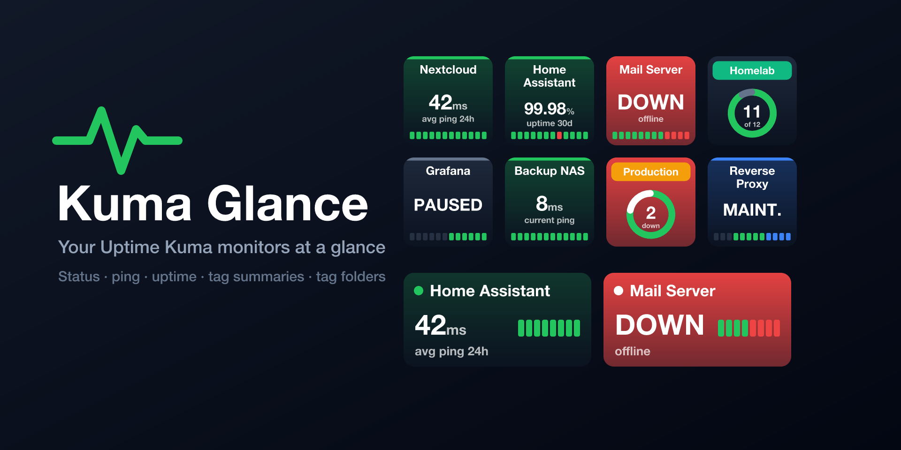

# Kuma Glance

Your [Uptime Kuma](https://github.com/louislam/uptime-kuma) monitors at a glance on your Elgato Stream Deck.



Unofficial plugin, not affiliated with the Uptime Kuma project.

## Features

* **Monitor** key for one monitor:
  * The status as background color: 🟩 up, 🟥 down, 🟨 pending, 🟦 maintenance, ⬛ paused / waiting for data.
  * The monitor name (left out if you set your own title on the key).
  * One value: current ping, average ping (24h), uptime 24h or uptime 30d. Pressing the key switches to the next value.
  * A strip with the most recent heartbeats.
  * Alternatively, pressing the key pauses / resumes the monitor.
* **Dial Monitor** (Stream Deck + / + XL): turn the dial to browse the monitors, push or tap to switch the value (or pause / resume). The touch strip shows name, value and heartbeats.
* **Tag Summary** key: pick an Uptime Kuma tag and see how many of its monitors are up or down. The key turns red as soon as one is down.
  * Pressing it opens a **tag folder**: a read-only profile with one key per monitor of that tag. Pressing a monitor opens its page in Uptime Kuma. With more monitors than keys, the last key pages through them. A Back key returns to the previous profile.
  * Tag folders exist for Stream Deck, Stream Deck Mini, Stream Deck XL, Stream Deck +, Stream Deck Neo, Stream Deck + XL and Corsair Galleon 100 SD (see [docs/TAG_FOLDERS.md](docs/TAG_FOLDERS.md)).
* Live updates over the Uptime Kuma Socket.IO interface, the same one the Uptime Kuma web UI uses. Works with Uptime Kuma 1.x and 2.x.

## Installation

Download the [latest release](https://github.com/kirkanos/kuma-glance/releases/latest) and open `com.kirkanos.kuma-glance.streamDeckPlugin`. Requires Stream Deck 7.1 or newer.

Then add a key, open its settings and log in with your Uptime Kuma URL, username and password (and 2FA code, if enabled). The password is only used once to get a login token and is not stored.

## Development

Kuma Glance is a Node.js plugin built with the official [Stream Deck SDK](https://docs.elgato.com/streamdeck/sdk/introduction/getting-started/) (`@elgato/streamdeck`, TypeScript, rollup). The settings pages use [sdpi-components](https://sdpi-components.dev).

| Path | Content |
| --- | --- |
| `src/actions/` | One class per Stream Deck action |
| `src/kuma/` | Socket.IO connection to Uptime Kuma and the monitor state |
| `src/render/` | SVG images for keys and touch strips |
| `src/tag-folders.json` | Devices with a tag folder profile |
| `plugin/` | Static plugin files: manifest, icons, settings pages (`ui/`), dial layout |
| `assets/` | Plugin icon source (rendered to PNG by the build) |
| `scripts/` | Build, tag folder profile generator, preview image |

```sh
npm install
npm test               # unit tests
npm run typecheck

# Development: a parallel-installable copy "Kuma Glance (dev)"
npm run link:dev       # build + link into Stream Deck (once)
npm run watch:dev      # rebuild and restart the plugin on every change

npm run pack           # Release/com.kirkanos.kuma-glance.streamDeckPlugin
npm run preview        # docs/preview.png
```

Linking and restarting need the Stream Deck developer mode (`npx streamdeck dev`, then restart the Stream Deck app once). Plugin logs are written to `dist/<plugin id>.sdPlugin/logs/`.

Releases are built by Woodpecker CI for tags like `v2.0.0`.

## Troubleshooting

* **Keys show "Offline":** check the URL in the key settings and that Uptime Kuma is reachable from this computer.
* **Keys show "Log in" or "check login":** log in again in the key settings; the login token may have been revoked in Uptime Kuma.
* Anything else: [open an issue](https://github.com/kirkanos/kuma-glance/issues).
